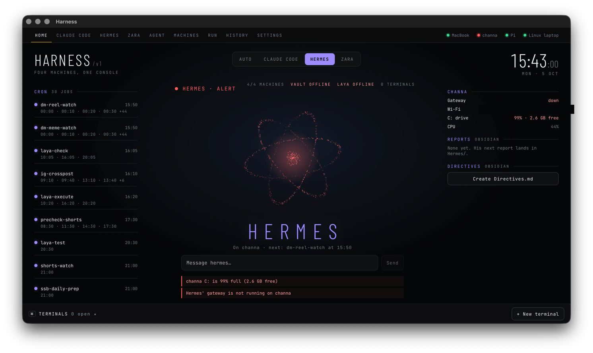

# Harness

One window over the whole tailnet. A Tauri desktop app that watches four
machines, opens terminals on any of them, talks to the agents living on them,
and keeps the content pipelines under a thumb.



## What it does

- **Live fleet status.** MacBook (macOS), channa (Windows), the Pi, and the
  Linux laptop — CPU/load, memory, disk and failed units, probed over SSH
  (Tailscale only). Polling backs off while the window is hidden.
- **Terminals anywhere.** xterm.js sessions on any machine; the PTYs live in
  the Rust backend, so SSH and local shells behave the same.
- **Home modes.** AUTO, CLAUDE CODE, HERMES, ZARA — each mode gets its own
  colour, particle-core shape, and side panels scoped to what that agent needs
  (machines for Claude Code, jobs for Hermes, today's pipelines for Zara).
- **Chat with the agents where they live.** Claude Code sessions on whichever
  machine you pick, Hermes on channa, Zara on the Pi — straight from Home.
- **Pipeline controls.** Post the next Short to YouTube, cross-post to
  Instagram, hold/release/fact-check Shorts, draft LinkedIn posts, YouTube
  stats — the buttons hit the Pi.
- **Run / History / Settings.** Fire a command on any machine and see a log of
  past runs; a standalone agent tab works against any OpenAI-compatible
  endpoint, with the API key kept in the OS keychain and never in the web view.

## The fleet

| Machine      | OS      | Role                                  |
| ------------ | ------- | ------------------------------------- |
| MacBook      | macOS   | Laptop · Xcode, Claude                |
| channa       | Windows | Hermes · carousels                    |
| Pi           | Linux   | Zara · Shorts · LinkedIn pipelines    |
| Linux laptop | Omarchy | This cockpit's other seat, the digest |

Devices are editable at runtime — they're JSON in the app config dir
(`devices.json`); the defaults shipped in `src-tauri/src/devices.rs` are just
the tailnet as of Sep 2026.

## Develop

```bash
export PATH="$HOME/.cargo/bin:$PATH"   # if your login shell skips cargo
npm install
npm run tauri dev
```

Vite serves the frontend on http://localhost:1420; the Rust backend compiles
on first run (~2 min cold). The app only runs as a native window — in a plain
browser the Tauri commands that power everything aren't there.

Claude Code users: `.claude/skills/run-harness/` has the verified recipe.

## Install

**macOS**

```bash
npm run tauri build
ditto src-tauri/target/release/bundle/macos/Harness.app /Applications/Harness.app
```

(A versioned `.dmg` lands next to the `.app` if you'd rather archive that.)

**Linux**

```bash
npm ci && npx tauri build --no-bundle
ops/install-linux.sh
```

installs `~/.local/bin/harness`, a launcher entry, and the 21:30 digest timer.
On Omarchy/Hyprland, `SUPER + H` is a natural keybind for it.

## ops/

- `install-linux.sh` — what it says, plus the digest timer.
- `digest/` — a 21:30 pipeline digest: asks the Pi what Shorts / Instagram /
  LinkedIn did today and writes a Pipelines section into the vault's daily note.
- `vault-sync.sh` — pairs the laptop's Obsidian vault with the Pi over
  Syncthing (Tailscale only).
- `hermes/obsidian-vault/` — copy of Hermes's vault skill from channa.

## Stack

Tauri 2 · React 19 · TypeScript · Vite · xterm.js · rustls/reqwest.
